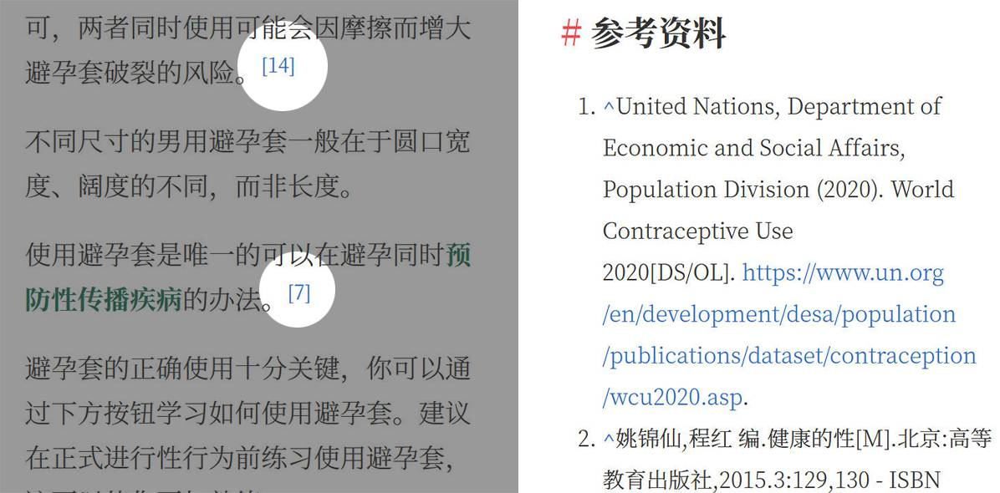

# Reference for Jinja2

[中文文档 / Chinese Document](#中文文档)

The file `refer.j2` is a tool for inline citations in Jinja2. It'll create a small, numbered footnotes for references.

This is designed for the sex education website [KnowSex.net](https://knowsex.net).



## Usage

Import it on the page.
```jinja

```
Use JSON create a **reference variable** in the specified format.
```jinja

```
For example:
```jinja
{% set data = [
    {
            "name": "WCU2020",
            "caption": "United Nations, Department of Economic and Social Affairs, Population Division (2020). World Contraceptive Use 2020[DS/OL]",
            "url": "https://www.un.org/en/development/desa/population/publications/dataset/contraception/wcu2020.asp"
    },
    {
        "name": "SBHM",
        "caption": "Alfred Charles Kinsey, Wardell Baxter Pomeroy, Clyde Eugene Martin.Sexual Behavior in the Human Male[M].1948:511 - ISBN 978-0-253-33412-8"
    }
]%}
```
Use a [macro](https://jinja.palletsprojects.com/en/3.1.x/templates/#macros) for creating a mark.
```jinja
{{ refer.mark(name , reference_variable[, page]) }}
```
```jinja
Lorem ipsum dolor sit amet,{{ refer.mark('WCU2020', data) }} consectetur adipiscing elit, sed do eiusmod tempor incididunt ut labore et dolore magna aliqua.{{ refer.mark('SBHM', data, 15) }}
```
It will display as:

> Lorem ipsum dolor sit amet,<sup>[1]</sup> consectetur adipiscing elit, sed do eiusmod tempor incididunt ut labore et dolore magna aliqua.<sup>[2]:15</sup>

Use this to place a reference list:
```jinja
{{ refer.footer(data) }}
```
It will make the reference with `<li>` inside `<ol class="reference-list">`.

> 1. ^Alfred Charles Kinsey, Wardell Baxter Pomeroy, Clyde Eugene Martin.Sexual Behavior in the Human Male[M].1948:511 - ISBN 978-0-253-33412-8.
> 2. ^United Nations, Department of Economic and Social Affairs, Population Division (2020). World Contraceptive Use 2020[DS/OL]. https://www.un.org/en/development/desa/population/publications/dataset/contraception/wcu2020.asp.


# 中文文档
`refer.j2` 是为 Jinja2 的行内引用设计的。它可以创建一个参考资料的序号角标。

此工具为性教育网站“[知性 KnowSex](https://knowsex.net) ”设计。


## 使用办法
在页面引用该文件。
```jinja

```
像这样用 JSON 创建一个**参考文献列表变量**。
```jinja

```
示例：
```jinja
{% set data = [
    {
            "name": "WCU2020",
            "caption": "United Nations, Department of Economic and Social Affairs, Population Division (2020). World Contraceptive Use 2020[DS/OL]",
            "url": "https://www.un.org/en/development/desa/population/publications/dataset/contraception/wcu2020.asp"
    },
    {
        "name": "SBHM",
        "caption": "Alfred Charles Kinsey, Wardell Baxter Pomeroy, Clyde Eugene Martin.Sexual Behavior in the Human Male[M].1948:511 - ISBN 978-0-253-33412-8"
    }
]%}
```
使用[宏](http://docs.jinkan.org/docs/jinja2/templates.html#id19)创建角标：
```jinja
{{ refer.mark(name , 参考文献列表变量[, 页码]) }}
```
```jinja
Lorem ipsum dolor sit amet,{{ refer.mark('WCU2020', data) }} consectetur adipiscing elit, sed do eiusmod tempor incididunt ut labore et dolore magna aliqua.{{ refer.mark('SBHM', data, 15) }}
```
生成后效果如下：

> Lorem ipsum dolor sit amet,<sup>[1]</sup> consectetur adipiscing elit, sed do eiusmod tempor incididunt ut labore et dolore magna aliqua.<sup>[2]:15</sup>

参考文献列表的生成使用如下：
```jinja
{{ refer.footer(data) }}
```
它将会在 `<ol class="reference-list">` 元素中创建若干含有单条参考文献的 `<li>` 变量：

> 1. ^Alfred Charles Kinsey, Wardell Baxter Pomeroy, Clyde Eugene Martin.Sexual Behavior in the Human Male[M].1948:511 - ISBN 978-0-253-33412-8.
> 2. ^United Nations, Department of Economic and Social Affairs, Population Division (2020). World Contraceptive Use 2020[DS/OL]. https://www.un.org/en/development/desa/population/publications/dataset/contraception/wcu2020.asp.
